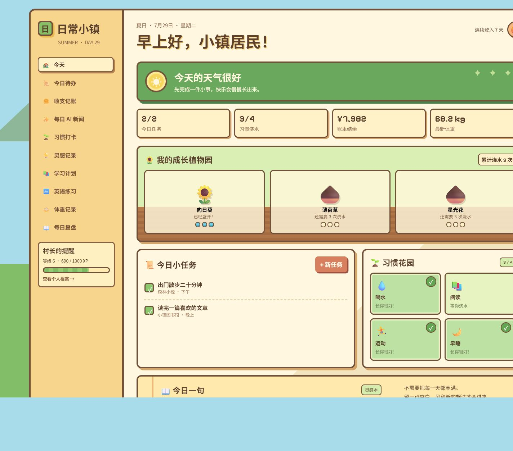
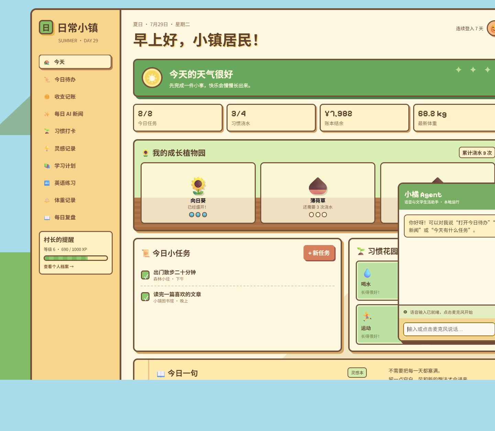
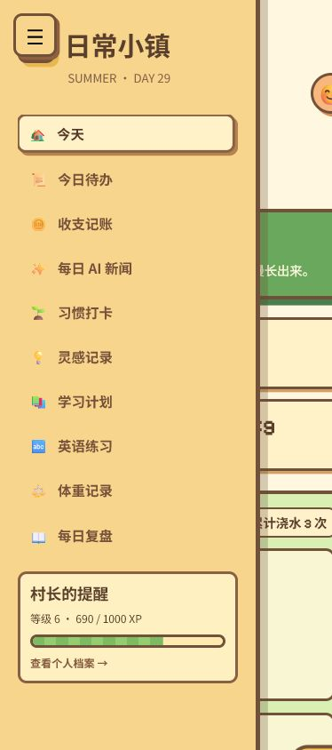

# 日常小镇 · 像素生活工作台

一个温暖、轻量、可直接使用的个人生活工作台。

## 功能

- 今日待办与任务完成奖励
- 植物浇水和成长系统
- 收支记账
- 每日 AI 新闻
- 免 API 密钥实时抓取 AI 新闻，每 30 分钟自动更新
- 习惯打卡
- 灵感记录
- 学习计划
- 英语练习
- 体重记录
- 每日复盘
- 可编辑个人档案
- 文字与语音生活助手
- 在线英语词典、每日句子、发音和 BBC/VOA 课程入口
- XP、小镇币、连击、里程碑宝箱和任务浇水奖励
- 本地数据持久化
- 桌面端和手机端响应式布局

## 本地运行

项目不需要安装依赖。

```bash
python -m http.server 4175
```

然后打开：

```text
http://localhost:4175/
```

## 数据说明

数据保存在浏览器 `localStorage` 中。首次使用语音输入时，需要允许浏览器访问麦克风，推荐使用最新版 Chrome 或 Edge。

实时新闻来自 Hacker News 搜索接口，英语释义与发音来自 Free Dictionary API，均不需要用户配置 API 密钥。断网时页面会保留上次成功获取的内容和内置示例。

## 页面预览

### 桌面端首页



### 植物成长与语音助手



### 手机端抽屉导航


